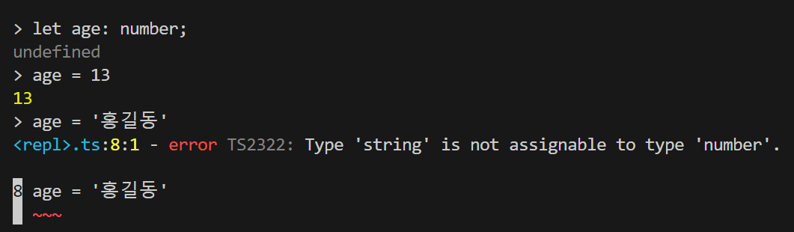

# CH02.TypeScript

TypeScript 공식 사이트



D:\Anne\my-app> npx ts-node  // ts-node 명령모드로 들어가는 거.

설치할래? 하면 y 하면 됨.

타입 지정

자바스크립트는 타입을 가리지 않는데, 타입스크립트를     사용하면타입을 지정할 수 있음.

let name: string; // 이렇게 string으로 타입을 지정해두면, int 입력시 에러 발생.

let age: number; // string 입력시 에러 발생.

<figure><figcaption></figcaption></figure>

let human: { ... name: string; ... age: number; ... }; // 타입스크립트에서는 이런 형태로 많이 사용 한다고 함.

타입 정의 가능 : type을 써주면 됨.

type Human = { ... name: string; ... age: number; ... };

{% embed url="https://www.typescriptlang.org/ko/docs/handbook/typescript-in-5-minutes.html#%ED%83%80%EC%9E%85-%EC%A0%95%EC%9D%98%ED%95%98%EA%B8%B0-defining-types" %}

let boy: Human;  // boy가 Human 타입으로 선언 됨.

interface 로도 타입 정의 가능.

interface Human = { ... name: string; ... age: number; ... };

함수 작성할 때도 타입 지정 가능 함.

function add(x: number, y: number): number { return x + y; }

아래와 같이 정해진 값으로 타입을 지정할 수도 있음. 아래와같은형태로타입을지정하면,     food 만 입력 가능 함. food 외의 다른 값 입력하면 에러 발생.

let category: 'food';

category = 'food';

배열

let numbers: number\[];

복합 : any 가 있음.&#x20;

let anythings: any\[];

anythings = \['hp', 256];

자리마다 지정하고 싶다면,(튜플)

let pair: \[string, number];

pair = \['hp', 256];

보통 아래와 같이 작성하면, 알아서 name이 string이겠구나. 하고 추론 함.

const name = '홍길동';

Union Type(합집합?) : 정해진 값 들 중 하나인 느낌.

let y: true | false;  <- true 아니면 false 둘 중 하나 넣을 수 있음. 이게 유니온.

type Category = 'food' | 'toy' | 'bag'; // 3개 중 1개

유니온을 React에서 많이 쓰나 봄...&#x20;



매우불편하다.  그래서 기본 값을 잡아주는것같음.

물음표 기호(?)를 써서 Optional Parameter로 처리하는 걸 추천한다고 함. 값이 없을 경우 기본값도 넣어 주면 좋음.

function add(x:number, y?:number | undefined) { return x + (y || 0);}

add(1) -> 1

add(2) -> 2

add(2,3) -> 5

function greeting({ name, age }: { name: string; age?: number; } = { name: '' }): string { return age ? '`${name} (${age})'` : name; }

위와 같이 작성하면 빈값으로 함수를 불러도 에러 발생하지 않음.

greeting() -> ''

greeting({ name: 'Hong' }) -> 'Hong'

greeting({ name: 'Hone', age: 13 }) -> 'Hone (13)'

Intersection Type(교집합?) : 타입을 확장하는 거라 함.

타입 여러개 넣어줄 수 있나 봄.

type Human = { name: string; age: number; };

type Creature = { hp: number; mp: number; };

type Person = Human & Creature;  // 둘 다 만족시켜야 함.

let person: Person;

person = { name: '홍길동', age: 13, hp: 256, mp: 16 };

Generics: <> 를 이용해서&#x20;

function identity\<Type>(arg: Type): Type { return arg; }

Utility Types

이거 참고 하기



